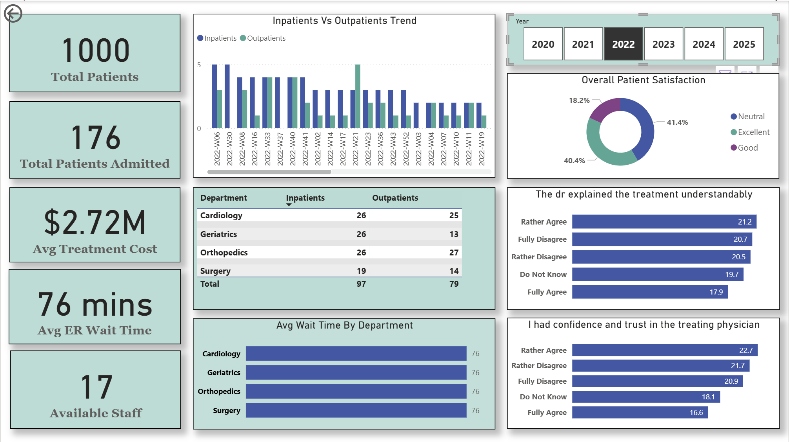
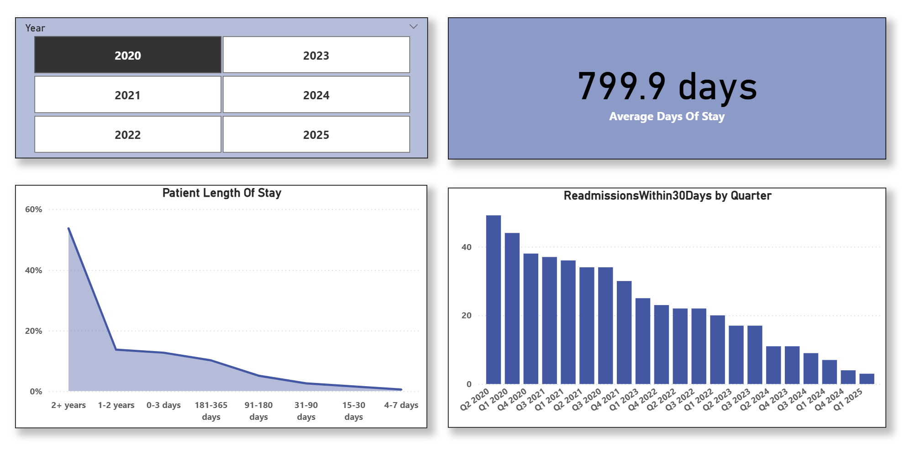

# 🏥 Hospital Patient Care Dashboard (Power BI)

This repository contains an interactive **Hospital Patient Care Dashboard** built in Power BI.  
The report highlights key hospital KPIs—including patient volume, satisfaction, wait times, treatment cost, staff availability, readmissions, and departmental performance.

---

## 🖼️ Dashboard Preview

---

## 📊 Key Insights

### **Operational KPIs**
- **1000 Total Patients**
- **176 Total Patients Admitted**
- **$2.72M Avg Treatment Cost**
- **76 mins Avg ER Wait Time**
- **17 Available Staff**

### **Clinical & Service Insights**
- **Inpatients vs Outpatients Trend** (weekly)
- **Department-Level Patient Split** (Cardiology, Geriatrics, Orthopedics, Surgery)
- **Avg Wait Time by Department**
- **Overall Patient Satisfaction**
- **Physician Communication & Trust Scores**

### **Length of Stay & Readmissions**
- **Average Days of Stay: 799.9 days**
- **Length of Stay Distribution**
- **Readmissions Within 30 Days by Quarter**
- **Year-wise Slicer (2020–2025)**

---

## 🗂️ Files in This Repo

- `HospitaDataAnalysis.pbix` – Full Power BI dashboard  
- `Hospital_Measures.dax` – All DAX calculations  
- `README.md` – Documentation  
- `/assets` – Screenshots for the repo

---

## ⚙️ Data Model (High-Level)

Tables used:
- **Patient**
- **Admissions**
- **TreatmentCosts**
- **WaitingTimes**
- **Staff**
- **SatisfactionSurvey**
- **BedOccupancy**
- **Readmissions**
- **ConsultationSummary, CostsByPayer, EquipmentUtilization, LabTests** (depending on pbix structure)

---

## 📦 How to Use

1. Download `HospitaDataAnalysis.pbix`  
2. Open in **Power BI Desktop**  
3. Explore KPIs, filters, and departmental insights  
4. Modify DAX using `Hospital_Measures.dax` if needed  
5. Publish to Power BI Service for web access

---

## 📈 Ideal Use Cases

- Hospital operations dashboard  
- Healthcare analytics portfolio  
- Patient satisfaction & readmission monitoring  
- Department & ER performance tracking  
- Root-cause analysis for long wait times or low satisfaction

---

## 🚀 Future Enhancements

- Add departmental drill-through pages  
- Add risk scoring for high-readmission patients  
- Connect to real-time data sources  
- RLS for doctor/department-level access  
- Benchmarking visuals for national averages  

---

Made with ❤️ using **Power BI**, **DAX**, and **Healthcare Analytics**.
